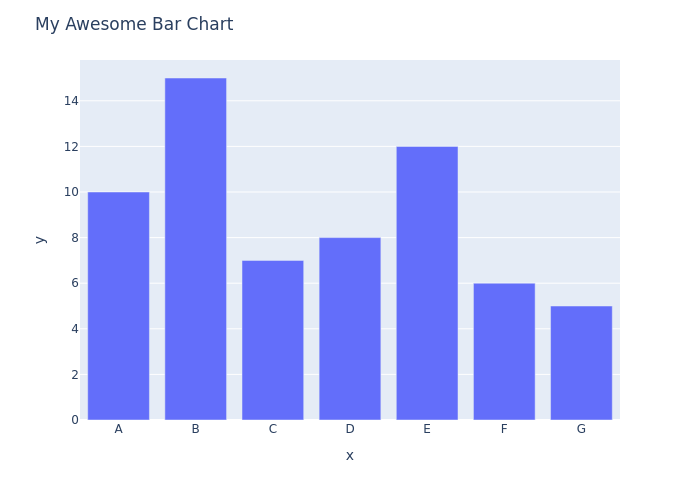
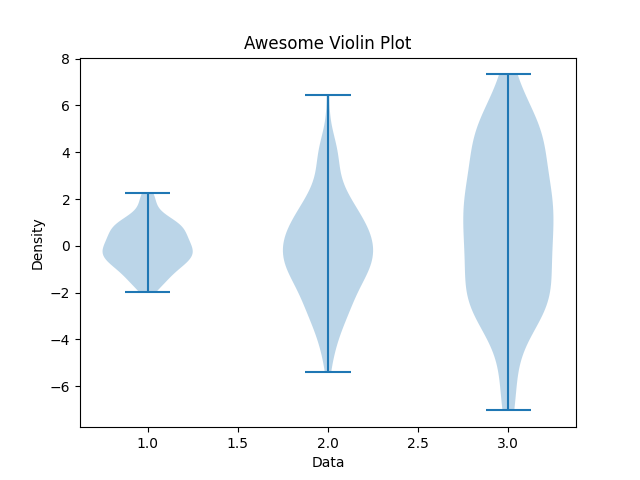

= Generate Charts and Barcodes using Python

== Whats in it
Some examples of turning information into visuals.
Inspired by awesome  https://www.linkedin.com/company/pythonclcoding/posts/[Python Coding Community on Linkedin]

Some of their published examples examples require some extra steps which i couldn't find in the description.  

This devcontainer should have you covered and everything should work OotB.

== Prerequisits
- Docker/Podmamn
- Visual Studio Code w DevContainer Extension

==== Charting

==== Donut Charts
. file://./DonutCharts.py[DonutCharts.py]

=== https://www.linkedin.com/posts/pythonclcoding_sunburst-chart-in-python-httpslnkdin-activity-7269372257771114496-06Nu[Sunburst Diagram]
Based on https://plotly.com/python/choropleth-maps/[plotly] to render visuals from data.
. SunburstCharts.py

=== Violin Chart

. ViolinCharts.py

=== Barcodes
Generate `EAN-13` barcodes.
. BarCoder.py

=== QR Codes
QR Codes are generated using https://segno.readthedocs.io/en/latest/[segno] package. The animated qr code makes use of the https://pypi.org/project/qrcode-artistic/[qrcode artistic] plugin.

. QRCoder.py:generate_plain_qr_code

. QRCoder.py:generate_animated_qr_code

=== Density Plot
[Example implementation of a DensityPlot](https://www.linkedin.com/posts/pythonclcoding_density-plot-using-python-httpslnkdin-activity-7250136270113259520-JKxZ) as described by Plthon Coding on LinkedIn.

. DensityPlotter.py

== Links
* https://plotly.com/python/getting-started/#static-image-export[Export static images from plotly.express]
* Default https://docs.astral.sh/ruff/configuration/#__tabbed_1_2[ruff.toml] from here.
* https://leonardofaria.net/2023/02/10/using-recommended-extensions-and-settings-in-vs-code[Using recommended extensions and settings in VS Code]
